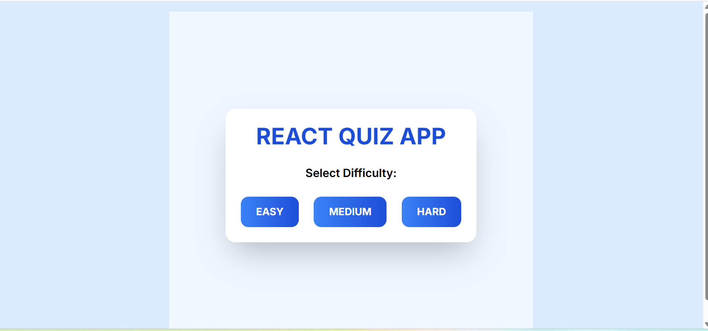
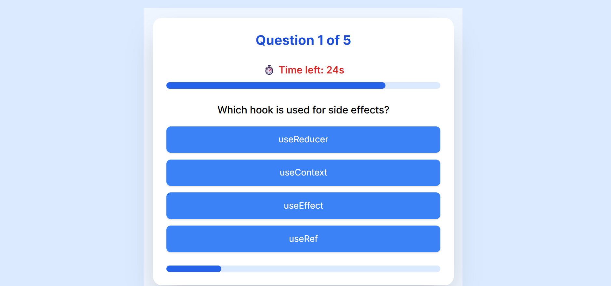
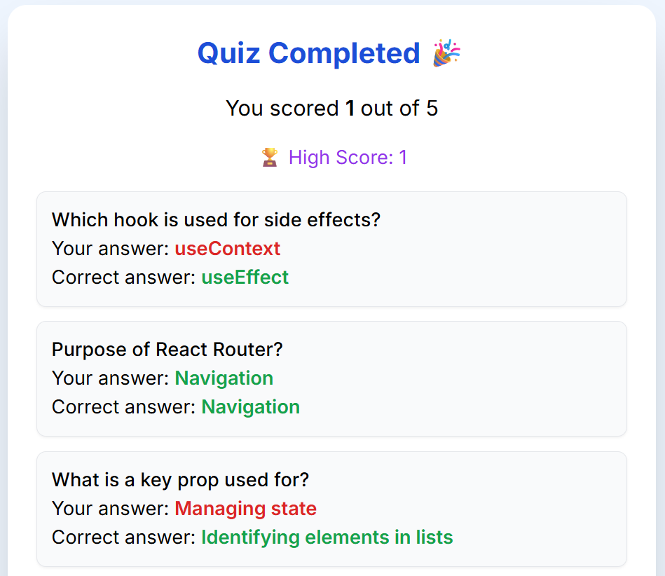
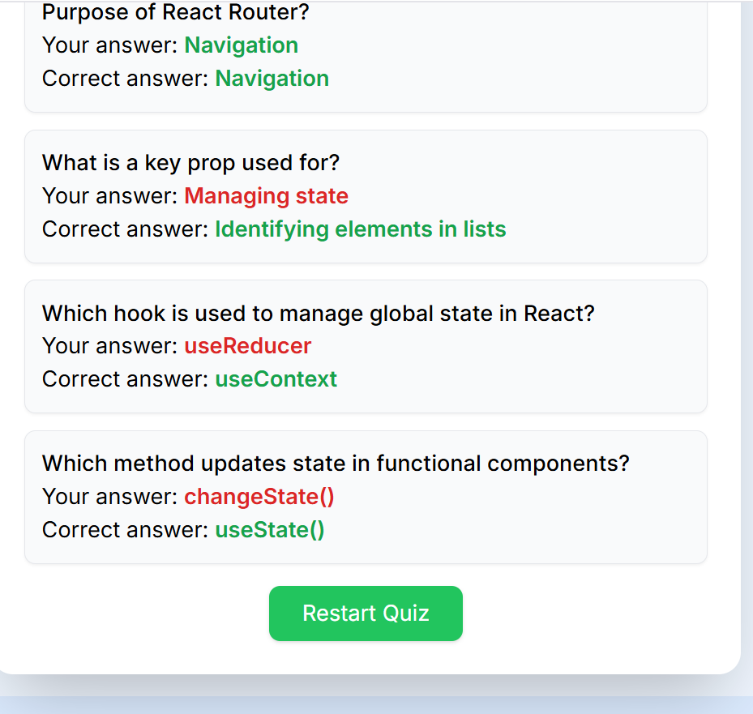

 
React Quiz App
Overview

React Quiz App is a fun and interactive web application built with React and Tailwind CSS. It allows users to test their knowledge with multiple-choice questions across different difficulty levels: Easy, Medium, and Hard.

The app is colorful, responsive, and includes a 30-second timer, progress tracking, and a high score feature.

Features:

Difficulty Selection: Easy / Medium / Hard

Timed Questions: 30 seconds per question

Progress Bar: Tracks how many questions you’ve answered

Score Tracking: See your current score and the highest score

Restart Quiz: Reset and try again

Responsive & Colorful UI: Works on desktop and mobile devices with hover effects

SCREENSHOTS:
      

     
     
     
     

How to Run:

Clone the repository:

git clone https://github.com/Arbiajaved/React-Quiz-App.git

Navigate to the project folder:

cd REACT-QUIZ-APP

Install dependencies:

npm install

Run the app locally:

npm run dev

Open your browser at the URL shown (usually http://localhost:5178) to start the quiz.

Tech Stack

React.js – Frontend library for building interactive UI

Tailwind CSS – Styling framework for responsive and colorful design

JavaScript – Logic and interactivity

Author

Arbia Javed
B.Tech Student

